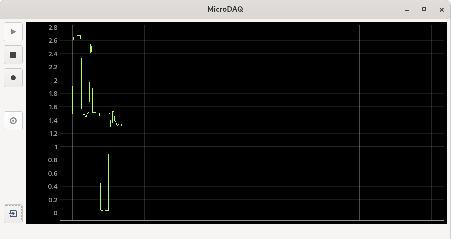
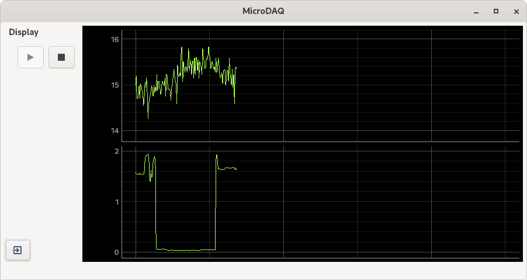

# microdaq

Read and plot serial data from a microcontroller.

`microdaq` displays serial data in real time. It is intended as a simple way to plot data from a microcontroller. It is not very efficient in the way resources are used, as it repeatedly reads ascii from the serial port `print`ed line-by-line by the microcontroller, but it helps to quickly evaluate microcontroller-acquired data values with minimal effort.

## Usage

1. Connect your microcontroller to your "master" computer [1]. Set up the microcontroller to send data over the serial port (typically with `print` or `printf`). For example, with this micropython code analog data is read and printed every 500 ms:

```python
from machine import ADC
import utime

conversion_factor = 3.3/(2**16-1)

# Light-dependent resistor
ldr = ADC(26)

while True:
    ldr_adc_val = ldr.read_u16()
    ldr_voltage = ldr_adc_val * conversion_factor
    print(ldr_voltage)
    utime.sleep_ms(500)
```

In this particular example, a photoresistor (a light-dependent resistor) was connected to Raspberry Pico (adc pin 26) in order to measure the relative intensity of ambient light.

2. Run `python microdaq.py` on the "master" computer. Click the "play" button to plot the data from the microcontroller. In this example the y-axis units are volts (as established in the micropython code above when adc values are converted to voltage before printing):



3. More that one signal can be plotted simultaneously. Just set your microcontroller to print more than one value as needed. For example, to the Pico above one (analog) thermometer was connected to adc pin 28. The micropython code is now:

```python
from machine import ADC
import utime

conversion_factor = 3.3/(2**16-1)

# Light-dependent resistor
ldr = ADC(26)

# Thermometer (TPM37, analog)
tmp37 = ADC(28)

while True:
    tmp37_adc_val = tmp37.read_u16()
    tmp37_voltage = tmp37_adc_val * conversion_factor
    tmp37_temperature = tmp37_voltage/0.02

    ldr_adc_val = ldr.read_u16()
    ldr_voltage = ldr_adc_val * conversion_factor

    print(tmp37_temperature, ldr_voltage)

    utime.sleep_ms(500)
```
Running `microdaq` will detect and plot the two signals. In this figure, the top trace is the ambient temperature (in degrees C) and the bottom trace is the relative ambient light intensity (in volts):




## Requirements

* [NumPy](https://numpy.org/)
* [PyQtGraph](http://pyqtgraph.org/)
* [pySerial](https://github.com/pyserial/)


## Notes

[1] The baud rate and serial port are hardcoded as global variables in the `microdaq.py` file. These default values work well for a Raspberry Pico connected to a master computer running Linux. You may need to adjust these parameters according to your needs.